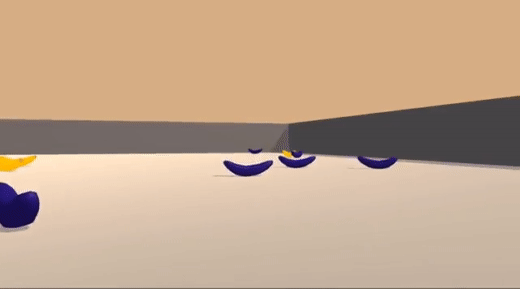

# Value and Policy based methods algorithm using pytorch

<p align="center"> 
    
</p>

In this repository you will found, value based methods implementations (i.e Deep Q-Networks).
They will be tested on Unity Banana environement where an agent have to:
- Gather all yellow bananas (+1 reward)
- Avoid violet bananas (-1 reward)

To perform optimally, the agent goal will be to collect as many banana as necessary.
And to achieve this goal, the agent will be interacting as follow:
- `0`: do nothing (the environment make the agent move forward automatically)
- `1`: move backward
- `2`: turn left
- `3`: turn right 

This enironnment should be considered solved when the agent will have a consistent averaged score of 15 (over 100 episodes).

## Installation:

After having cloned the project.

Create and install dependencies:
```
pip install pipenv
pipenv install
```

Activate custom environment:
```
pipenv shell
```

In, `rl-vbm` install the minimal installation open ai gym with `classical_control` and `box2D` (to run in project root):
```
git clone https://github.com/openai/gym.git
pip install -e gym/
pip install -e 'gym/[box2d]'
pip install -e 'gym/[classic_control]'
```

This project use udacity deep-reinforcement learning repository as dependency (to run in project root):
```
git clone https://github.com/udacity/deep-reinforcement-learning.git
pip install deep-reinforcement-learning/python
```

1. Download the environment from udacity from the link below.
    - Linux: [click here](https://s3-us-west-1.amazonaws.com/udacity-drlnd/P1/Banana/Banana_Linux.zip)

2. Place the file in the `env/` folder, and decompress the file:
```
unzip Banana_Linux_NoVis.zip -d env/
```

if `unzip` is not installed:
```
sudo apt-get install unzip
```

## Instructions

To use jupyter notebooks, you may want to enable the environment with:
```
python -m ipykernel install --user --name=rl-vbm
```
```
jupyter notebook
```
[Jupyter] Be sure to select the right kernel by following `Kernel` > `Change Kernel` > `rl-vbm`.

Pre-trained agents can be found in `/pretrained_models`.

## References

### Udacity Repo
[deep reinforcment learning](https://github.com/udacity/deep-reinforcement-learning/tree/master/p1_navigation)

### Vanilla DQN
[Playing Atari with Deep Reinforcement Learning](https://www.cs.toronto.edu/~vmnih/docs/dqn.pdf)

### Dueling DQN
[Dueling Network Architectures for Deep Reinforcement Learning](https://arxiv.org/pdf/1511.06581.pdf)

