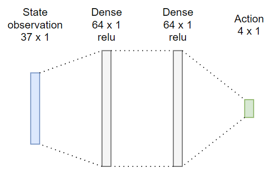
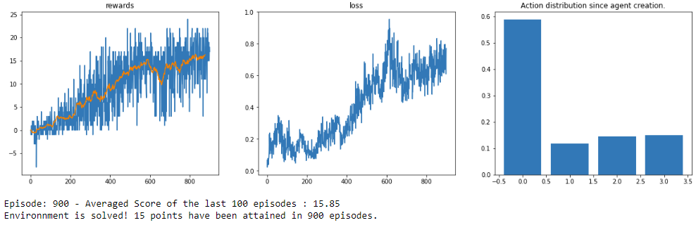
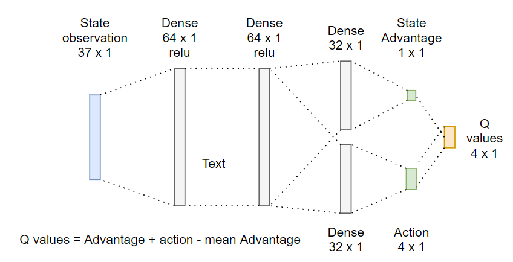
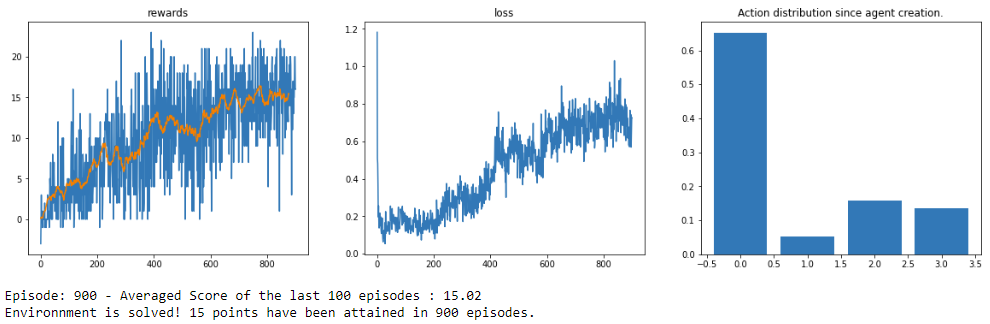

# Banana Environment:

Two algorithms have been implemented to tackle this environment:
- Deep Q-Network
- Dueling Deep Q-Network

## Hyperparameters:

Algorithms have been trained with respect to this parameters:
    - Optimizer:
    `learning rate`: 5e-4,
    
    - Decaying epsilon greedy options:
    `e start value`: 1
    `e minimal value`: 0.01,
    `decaying ratio`: 0.995,

    - Q-value update:
    `gamma`: 0.98,

    - Fixed target update options:
    `Soft update model τ`: 1e-3,
    'update frequency (agent decision periode)': 10,

    - Experience replay parameters:
    `memmory size (in state)`: 1000
    `experience batch`: 64,

    `episode time limit`: 1000 iterations

## Experiment:
This enironnment should be considered solved when the agent will have a consistent averaged score of 15 (over 100 episodes).
To perform optimally, the agent goal will be to collect as many banana as necessary.
And to achieve this goal, the agent will be interacting as follow:
- `0`: do nothing (the environment make the agent move forward automatically)
- `1`: move backward
- `2`: turn left
- `3`: turn right

## Learning:

The learning is basically the succession of these steps:
- play with agent during n steps while storing its experiences.                       
- update agent behavior after n steps

## Deep Q-Network
### Model Architecture:

 
    

### Results:

 
    

## Dueling Deep Q-Network
### Model Architecture:

 
    

### Results:

 
    

## Discussion

The use of dueling networks helps to achieve better overall control by estimating within a state the advantage of the actions. With vanilla DQN, when actions are relatively equivalent (similar Q action value), our e greedy algorithm would have a tendency to switch. This method allows to better choose between actions when they are similar in terms of Q(s,a). We can see this effect by comparing actions distributions, with the decrease of the `action 1` selections count for `DDQN`. Intuitively, going backward might not be not as fruitful than turning left or right.

In terms of convergence speed, we do not observe a significant increase of `DDQN` over vanilla `DQN`. The hypothesis that could explain why it is this way are:
- The replication of the original paper might not be correct.
- The DDQN might be better than vanilla DQN overall, by repeating the experiment multiple times we could verify it.
- As per its [original paper](https://arxiv.org/pdf/1511.06581.pdf), the benefit of taking DDQN increase with the number of possible actions. Here we have 4 possible actions.

## Future Work

To improve the convergence speed, one solution would be to implement prioritize replays methods. This would allow the agent to improve it's representation of the environment.

Other works would be to implement [Rainbow](https://arxiv.org/abs/1710.02298). By beginning implementing update loss clipping since it improves the stability of the model.